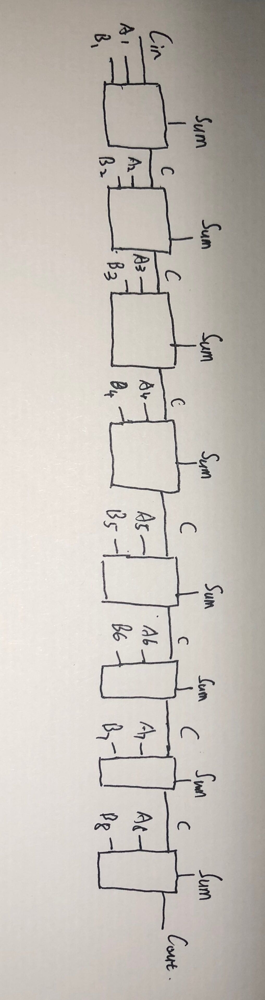

1) Give the three representations of an AND gate and say in your
words what AND means.
2) Give the three representations of an XOR gate and say in your
words what XOR means.
3) Draw a circuit diagram corresponding to the following Boolean
expression: (A + B)(B + C)
4) Show the behavior of the following circuit with a truth table:
5) What is circuit equivalence? Use truth table to prove the
following formula.
(AB)’ = A’ + B’  

# 1.与门三种表达方式为：  
X = A · B;  

   

   

### 在与门中，全部为真才是真,一个为假即为假，全部假也为假。  

# 2.xor gate的三种表达方式为：  

    

   

   

### 在xor gate中，全部假为假，全部真为真，一真一假为假。  

#  3.(A + B)(B + C) 

  

# 4.由图得 X=A'⊕A·B 

|A|B|A'|A·B|X|
|:-:|:-:|:-:|:-:|:-:|
|0|0|1|0|1|
|0|1|1|0|1|
|1|0|0|0|0|
|1|1|0|1|1|  

# 5.(AB)’ = A’ + B’ 

|A|B|A'|B'|(AB)'|A'+B'|
|:-:|:-:|:-:|:-:|:-:|:-:|
|0|0|1|1|1|1|
|0|1|1|0|1|1|
|1|0|0|1|1|1|
|1|1|0|0|0|0| 

由真值表得(AB)’ = A’ + B’成立。  

 # 6.There are eight 1bit full adder integrated circuits. Combine them to 8bit adder circuit using the following box diagram. 

6.;  

# 7.Logical binary operations can be used to modify bit pattern.  
Such as  
(X8X7X6X5X4X3X2X1)2 and (00001111)2 = (0000X4X3X2X1)2  
We called that (00001111)2 is a mask which only makes low 4 bits to work.  
Fill the follow expression  
(1)(X8X7X6X5X4X3X2X1)2 or (00001111)2=(X8X7X6X5X4X3X2X1)2  
(2) (X8X7X6X5X4X3X2X1)2xor (00001111)2 = (X8X7X6X50000)2  
(3) ((X8X7X6X5X4X3X2X1)2 and (11110000)2 )or
(not (X8X7X6X5X4X3X2X1)2and (00001111)2) = 
(X8X7X6X5X4'X3'X2'X1')2  

# 使用维基百科，解释以下概念。
## 1) Logic gate 
## 2) Boolean algebra 

### 1）Logic gate 
In electronics, a logic gate is an idealized or physical device implementing a Boolean function; that is, it performs a logical operation on one or more binary inputs and produces a single binary output. Depending on the context, the term may refer to an ideal logic gate, one that has for instance zero rise time and unlimited fan-out, or it may refer to a non-ideal physical device[1] (see Ideal and real op-amps for comparison). 

### 2) Boolean algebra 
In mathematics and mathematical logic, Boolean algebra is the branch of algebra in which the values of the variables are the truth values true and false, usually denoted 1 and 0 respectively. Instead of elementary algebra where the values of the variables are numbers, and the prime operations are addition and multiplication, the main operations of Boolean algebra are the conjunction and denoted as ∧, the disjunction or denoted as ∨, and the negation not denoted as ¬. It is thus a formalism for describing logical relations in the same way that elementary algebra describes numeric relations.  

# 1)Flip-flop 中文翻译是？  
### 触发器

# 2)How many bits information does a SR latch store? 
### 4 bits