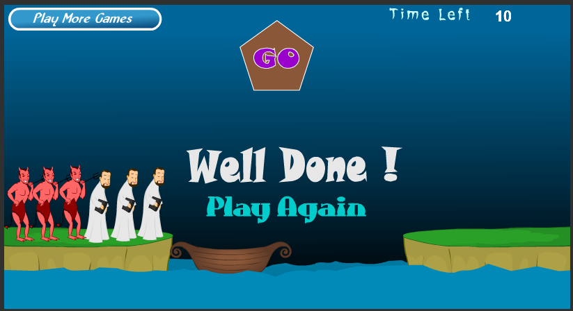

 ## 根据后面的素材，识别类和对象。 
 阅读“牧师与恶魔过河” 
 （ http://www.17yy.com/f/69854.html ） 的游戏介绍并玩游戏。然后回答问题 
– 游戏涉及哪些类。请列表说明  

        角色：牧师，恶魔
        交通工具：船
        景物：河流，陆地

– 游戏中有哪些对象，各几个。例如，船（一个） 
       
        牧师：三个
        恶魔：三个
        船：一个
        河岸，河流

– 类和对象的区别是什么？举一个例子说明 
        
        类包括了对象，对象在类之中。比如，牧师和恶魔是角色类。

– 游戏中的魔鬼，有哪些属性和方法？  

        当一边的恶魔比牧师多时，恶魔会杀死牧师

– 假设魔鬼被鼠标点中，会执行onclick事件，请用文字 （伪代码）描述这事件中魔鬼与其他对象沟通的过程。 

        if(魔鬼在船上)
        魔鬼跳上岸；
        else 
        魔鬼跳下船；
        开船；
        if(左边恶魔比牧师多)
        恶魔杀死牧师；
        else if(右边恶魔比牧师多)
        恶魔杀死牧师；

– 类或对象会是动词吗？

        可以是动词。
        
 