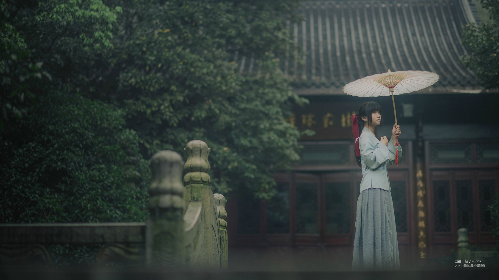

#  古风
### 古风的含义 

---------------------

  “古风”是一类新型的文化。“古风”以中国的传统文化为基调，结合中国传统的文学、琴棋书画、诗词歌赋等，经过不断的发展磨合，形成了比较完备的音乐、文学、绘画等艺术形式。
        
###  我与古风 

---------------------

  第一次接触古风文化是在高中，以前的我对古风文化的认知就是古体诗。在一次偶然的机会下，我接触到了古风歌曲。当时我就被深深吸引，因为其中的中国传统乐器与现代流行音乐能够美妙地结合在一起。于是我就开始寻找更多不同方面的古风文化，比如服装。古风文化中的服装大多数是汉服。汉服有一种飘逸的气韵，能让人感受到古代的悠远、悲凉。
        

  

