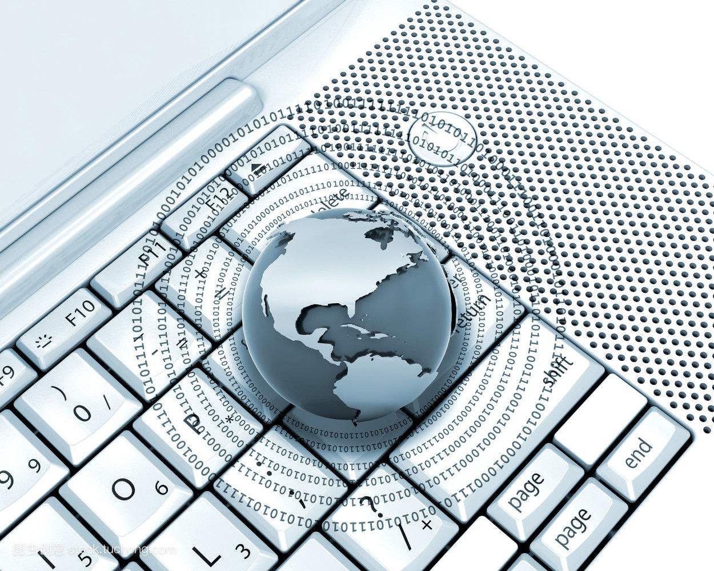

# 马云        
### &emsp;&emsp;马云是IT界的一个重要领军人物，我想这是毫无疑问的。创建巴里巴巴，经营多种类型的网络贸易，一路发展壮大至今,今年7月，在全球同步《财富》世界500强排行榜中排名第三百位。淘宝网，支付宝为人们带来多少的便利，为国家的经济增长也作出了不少的贡献。不过马云年轻时的经历可是十分坎坷曲折的。 
### &emsp;&emsp;马云出生于浙江杭州市，爷爷是一个抗战时期的保长。马云小时候对读书不感兴趣，曾因为打架太多而被记过开除。在他十二岁那年，他买了台袖珍收音机，从此每天听英语广播，为日后的英语学习营造了兴趣，打下了底子。 
### &emsp;&emsp;马云参加了三次高考，最后一次才因为英语成绩优秀而被杭州师范学校录取。马云也有好好地珍惜这次来之不易的机会，用功努力学习，当上了学生会主席。 
### &emsp;&emsp;毕业之后，马云开始了他的第一次创业，创立了一家互联网公司，从此，马云便与互联网脱不开关系了。 
### &emsp;&emsp;1999年3月，马云正式辞去公职，后来被称为18罗汉的马云团队回到杭州，凑够50万元人民币开始了新一轮创业，开发阿里巴巴网站。 
### &emsp;&emsp;1999年4月15日，阿里巴巴网站正式上线。Invest AB副总裁蔡崇信听说阿里巴巴后，飞赴杭州洽谈投资，在和马云谈了4天后，决定辞职加入阿里巴巴。 
### &emsp;&emsp;2003年5月10日，马云创立淘宝网，开始抢夺eBay易趣C2C市场。 
### &emsp;&emsp;2004年12月，马云创立第三方网上支付平台支付宝。 
### &emsp;&emsp;2005年8月17日，雅虎宣布以10亿美元现金和雅虎中国全部资产为代价，同时获雅虎10亿美元投资，换取马云创办的阿里巴巴40%的股份和35%的投票权，马云出任中国雅虎董事局主席。 
### &emsp;&emsp;2007年11月，马云创立的阿里巴巴网络有限公司在香港联交所主板挂牌上市。 
### &emsp;&emsp;2013年5月28日，阿里巴巴集团联合银泰集团、复星集团、富春集团、顺丰、中通、圆通、申通、韵达等多家民营快递企业联合成立菜鸟网络科技有限公司，并同时启动中国智能骨干网（CSN）项目建设，马云出任菜鸟网络科技有限公司董事长。 
### &emsp;&emsp;2014年9月19日，阿里巴巴集团于纽约证券交易所正式挂牌上市。 
### &emsp;&emsp;2018年7月31日，2018福布斯中国慈善榜发布，马云排名第14。 
### &emsp;&emsp;马云的经历告诉了我们IT的强大，也告诉了我们占领先机的重要性。IT行业目前是走在世界前端的行业，可以这么说，只要知道了IT未来的走向，你就能改变世界！       