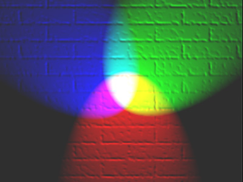

# 色彩与编码 
### 高保真颜色在电脑上按照16位存储，而真彩颜色则是用24位存储。不同的颜色有不同的代码定义。 
### 在电脑中三原色为红绿蓝，这三种颜色分别用不同的深度相组合，就能变成千百万种不同的颜色。 
### 在不断的发展过程中，人们发明了一种颜色的编码方式——RGB。 
### 通过RGB，人们可以更轻松且快速地找到所需要的颜色，在电脑中表示出来。 (这只是一小部分的颜色编码，如要查询更多颜色，可以进入https://www.114la.com/other/rgb.htm查询)
