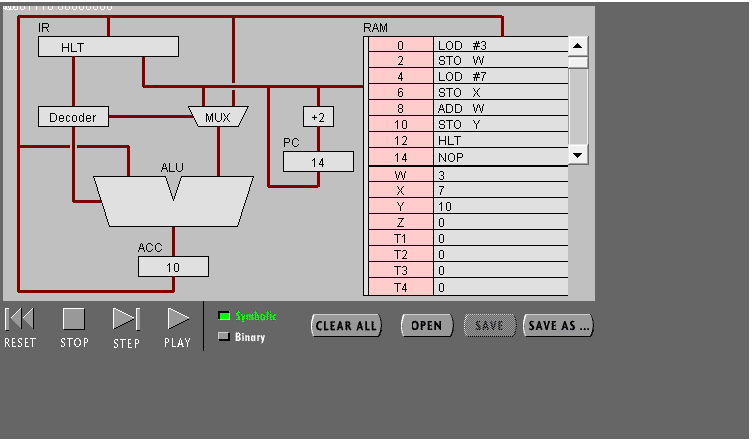
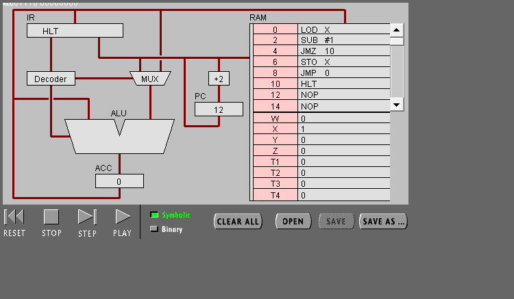
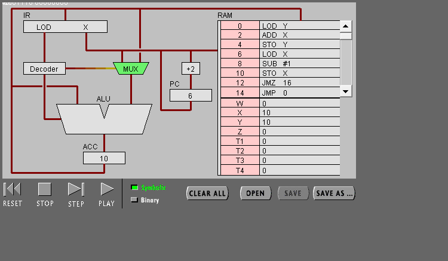
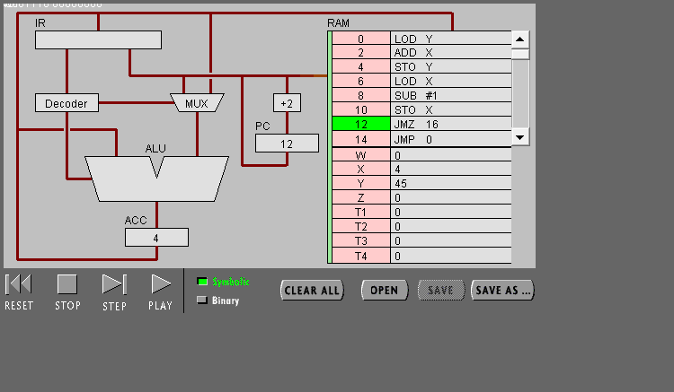
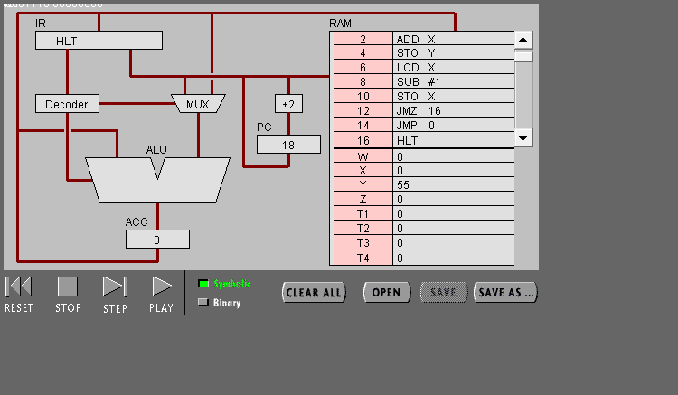

# 机器语言实验报告

## 任务一
 
1、PC，IR 寄存器的作用。 
    程序计数器（PC），通常称为指令指针,并且有时也被称为指令地址寄存器（IAR）。它的作用是读取地址和进入下一个地址。 
    IR 寄存器，指令寄存器（IR），其保持当前正在执行或解码该指令。  
2、ACC 寄存器的全称与作用 
    Accumulator(累加器) ，作用是存储了中间算术和逻辑结果。

3、用“LOD #3”指令的执行过程，解释Fetch-Execute周期。 

    cpu先从RAM的address0开始运行LOD #3,将指令寄存到IR，然后Decoder解码指令，将3存到MUX，然后再传入ACC。

4、用“ADD W” 指令的执行过程，解释Fetch-Execute周期。 
    
        cpu从RAM的address8开始运行ADD W，将指令寄存到IR，然后Decoder解码指令，ALU加法器从ACC取值，IR再从W中取值，然后W的值传入ALU中，ALU执行加法，将值传到ACC。

5、“LOD #3” 与 “ADD W” 指令的执行在Fetch-Execute周期级别，有什么不同 
    
    “LOD #3”指令只需访问一次RAM的address，“ADD W”则需先访问一次address，再取一次W的值。

（3）点击“Binary”,观察回答下面问题

1、写出指令 “LOD #7” 的二进制形式，按指令结构，解释每部分的含义。 
   
    “LOD #7”的二进制形式为00010100 00000111，00010100是指lode,即要做的事，00000111是二进制表示的7，即表示数值。

2、解释 RAM 的地址 
   
     RAM是内存，其中的地址只能暂时保存，关机后就没有了。

3、该机器CPU是几位的。（按累加器的位数） 
   
     8位的。

4、写出该程序对应的 C语言表达。 
   
    #include<stdio.h>
    int main(){
    int w=3,x=7,y;
    y=w+x;
    return 0;
    }

## 任务二
 
（1） 输入程序Program 2，运行并回答问题： 

1.用一句话总结程序的功能.
    
    该程序是将X减n次1，直到把X减成1为止。

2.写出对应的 c 语言程序

        #include<stdio.h>
        int main(){
         int x=3;
          while(x>1){
          x--;
          }
        }

（2） 修改该程序，用机器语言实现 10+9+8+..1 ，输出结果存放于内存Y
 
 
 
1、写出 c 语言的计算过程

        #include<stdio.h>
        int main(){
         int x,y=0;
        for(x=10;x>0;x--)
          y=y+x;
        return 0;
        }

2、写出机器语言的计算过程

    00000100 10000010
    00000000 10000001
    00000101 10000010
    00000100 10000001
    00010001 00000001
    00000101 10000001
    00001101 00010000
    00001100 00000000
    00001111 00000000

3、用自己的语言，简单总结高级语言与机器语言的区别与联系。

    高级语言是人类用来命令电脑或与电脑对话的语言，比较容易弄懂。
    而机器语言是电脑用来工作的语言，只有电脑自己清楚，人类比较难懂。
    高级语言通过编译形成机器语言，从而实现人与电脑的交流。

# 小结

通过一晚上的模拟CPU实验，我发现其实CPU运行时所执行的步骤比较繁琐，短短一个加法就要用多个步骤。因此人类如何制作出运算速度快的CPU是整个世界的问题。
