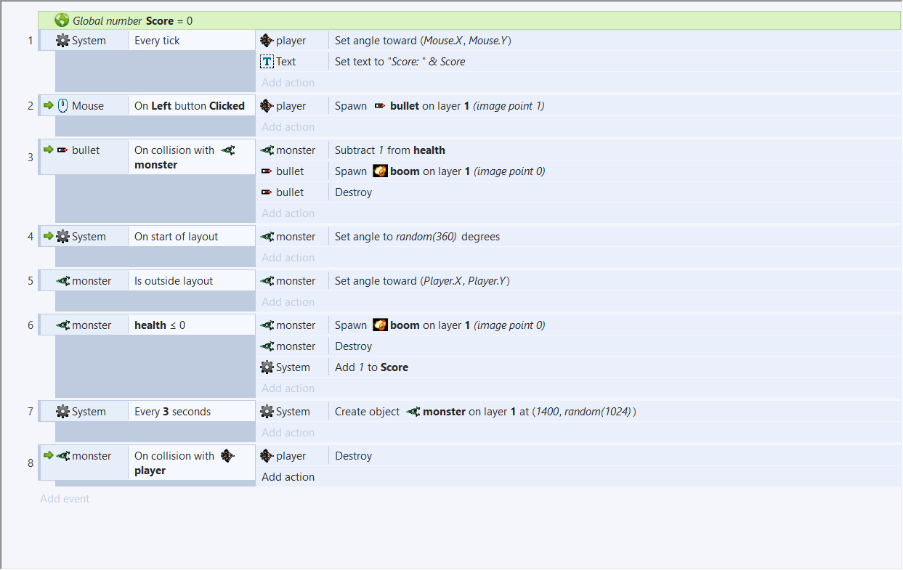
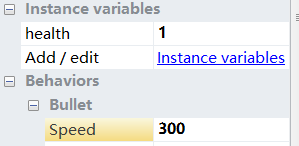
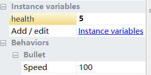
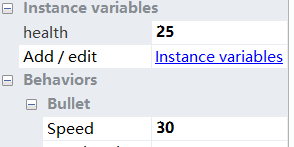
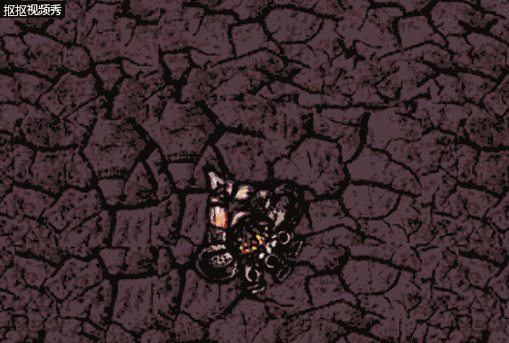

# 游戏设置 
## 游戏策划 
        
        故事起源：这个游戏的主角是一名勇者，他所在的世界被怪物所覆盖，人类似乎都已消失不见，只留下勇者孤单一人。勇者拥有着超人的技术头脑，他能够使用怪物身上的零件来制作强大的武器，于是，他就这样一直不断猎杀怪物，不断改造自己的武器，一边活下去，一边寻找着希望……
        
        
        

        翼魔:速度快，但生命值少，只能进行直线撞击，飞出界面之后重新面向玩家。
        
        爪牙：速度中等，生命值中等，但数量多，且生成速度快。
        
        山魔：速度慢，生命值很高，能够在前进时不断调整方向，一直面向勇者前进。
        
        
        
        岩浆怪：不断从地底吸取岩浆，然后向着固定的方向喷射岩浆。

        岩浆王：不断从地底吸取岩浆，向着玩家喷射岩浆。

 

## 小结

        在游戏的制作之中，我认为重要的一环就是创意。一个拥有好创意的游戏才能吸引到消费者。而我的游戏在这方面做得有许多不足，甚至十分粗糙。我会吸取这次的教训，争取使自己的游戏变得更加生动有趣。
        

