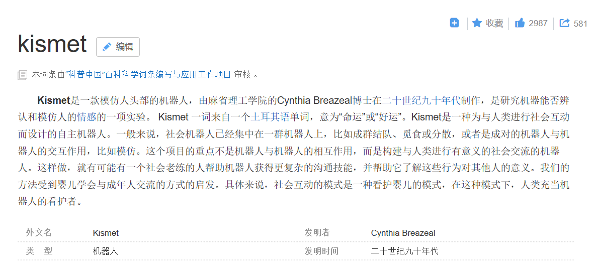

# AI技术与伦理

### 人工智能（Artificial Intelligence），英文缩写为AI。它是研究、开发用于模拟、延伸和扩展人的智能的理论、方法、技术及应用系统的一门新的技术科学。 

随着年代不断进展，人工智能也随之不断发展，那么就会出现一个问题：人工智能会有感情吗？答案是肯定的。

kismet是一个有感情的机器人，而电影中也有许多情节是根据AI有感情而发展的。

《我，机器人》是由亚历克斯·普罗亚斯执导的现代科幻电影，由当红影星威尔·史密斯，布鲁斯·格林伍德，詹姆斯·克伦威尔主演。该影片讲述了人和机器之间相处，人类自身是否值得信赖的故事。

“人工智能将影响我们每一个地球人，对社会的各个领域意义重大。”Knight基金会CEO Alberto Ibargüen 表示。尽管人工智能帮助人类干了不少事儿，比如用自动驾驶技术来减少大量的交通事故，扫描医学影像来发现癌症等等。 
　　但是有不少业界人士也在发出警告称AI很有可能在给人类带来帮助的同时，也带给人不小的威胁。 

    “AI的飞速发展带来了很多严峻的挑战，”麻省理工学院媒体实验室主任伊藤穰一(Joi Ito)解释道，“人工智能给社会以及人类带来了不可忽视的影响，机器变得越来越智能，以至于有时候我们会担心它们是否会脱离我们的控制。其中最关键的挑战之一就是，我们如何确保自己培训的机器永远不会产生并且放大人类的偏见，以此来困扰社会？我们该如何针对这项技术展开更广泛，深入的讨论？社会该如何与AI 共同演变？人们如何将计算机科学和社会科学连接在一起，开发出不仅‘聪明’，更重要的是对社会负责的智能机器？”
--------------------- 

来源：CSDN 
