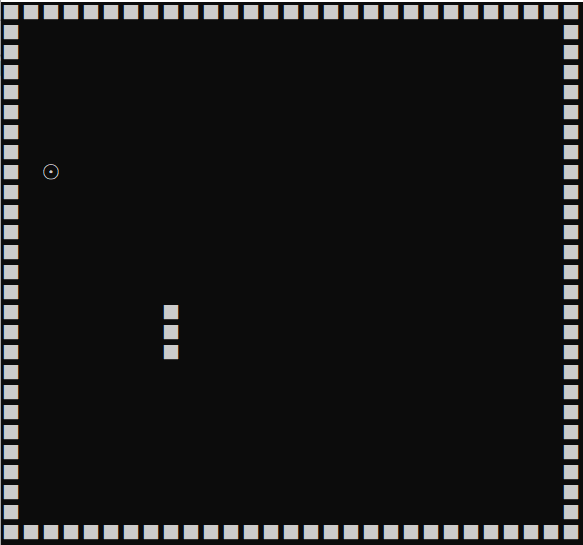

# 贪吃蛇

## 首先是主程序的伪代码

        输出字符矩阵
        WHILE not 游戏结束 DO
        ch＝等待输入
        CASE ch DO
        ‘A’:左前进一步，break 
        ‘D’:右前进一步，break    
        ‘W’:上前进一步，break    
        ‘S’:下前进一步，break    
        END CASE
        输出字符矩阵
        END WHILE
        输出 Game Over

由于做这个贪吃蛇所需要的指令比较多，所以我们需要引入几个库。
        
        #include<stdio.h>
        #include<string.h>
        #include<Windows.h>
        #include<time.h>
        #include<conio.h>

 # 蛇的移动

    
    void MovingBody(){
	int count=0;
	int a=head->x,b=head->y;
	snake*p=head;

	while (1){
		if(p->next == NULL)
		break;
		gotodelete(p->x, p->y);
		count++;
		p=p->next;
	}
	switch (click){
		case up:
			head->y-=1;
			ChangeBody(a,b);
			break;
		case down:
			head->y+= 1;
			ChangeBody(a,b);
			break;
		case left:
			head->x-=2;
			ChangeBody(a,b);
			break;
		case right:
			head->x+=2;
			ChangeBody(a,b);
			break;
		case stop:
			_getch();
			break;
	}
	p=head;
	while(1){
		if (p->next == NULL) break;
		gotoprint(p->x, p->y);
		p = p->next;
	}
	
	p=head;
	 
	gotoxy(0,28);
	
}

# 蛇吃东西

    void Eating(){
	if (head->x == food.x&&head->y == food.y){
		creatfood();
		snake *_new = (snake*)malloc(sizeof(snake));
		snake *p;
		p = head;
		while (1){
			if (p->next->next == NULL) break;
			p = p->next;
		}
		p->next = _new;
		_new->next = tail;
		score += 10;
		gotoxy(77, 15);
		printf("%d", score);
	    }
    }

完成这个游戏其实还需要另外几个函数,比如：
围墙的打印，食物的投放，蛇的方向的转变，蛇吃到东西后变长，吃到自己的身体时结束等等。
做这个游戏首先要明确步骤，先是让贪吃蛇动起来，然后让他去吃食物，不能碰到墙壁或自身，再将每一步细分，让蛇动起来的方法，吃到食物后食物跟蛇的变化，然后一步一步实现。 
