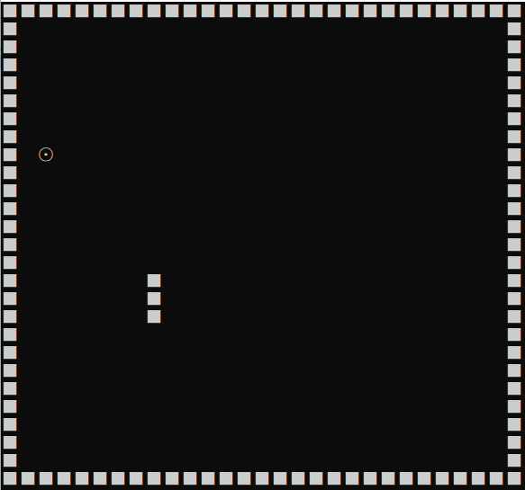

# 字符游戏 - 智能蛇（2）
在上一次的贪食蛇中，其实已经实现了贪食蛇的保持移动，那就是

    switch (click){
		case up:
			head->y-=1;
			ChangeBody(a,b);
			break;
		case down:
			head->y+= 1;
			ChangeBody(a,b);
			break;
		case left:
			head->x-=2;
			ChangeBody(a,b);
			break;
		case right:
			head->x+=2;
			ChangeBody(a,b);
			break;
		case stop:
			_getch();
			break;
	}

## 至于每一次移动都会发生闪屏的问题，做法可以是先删除然后再打印。

    void MovingBody(){
	int count=0;
	int a=head->x,b=head->y;
	snake*p=head;
	//通过先清空后打印实现动画效果
	while (1)
	{
		if(p->next == NULL)
		break;
		gotodelete(p->x, p->y);
		count++;
		p=p->next;
	}
	switch (click)
	{
		case up:
			head->y-=1;
			ChangeBody(a,b);
			break;
		case down:
			head->y+= 1;
			ChangeBody(a,b);
			break;
		case left:
			head->x-=2;
			ChangeBody(a,b);
			break;
		case right:
			head->x+=2;
			ChangeBody(a,b);
			break;
		case stop:
			_getch();
			break;
	}
	p=head;
	while(1){
		if (p->next == NULL) break;
		gotoprint(p->x, p->y);
		p = p->next;
	}
	
	p=head;
	 
	gotoxy(0,28);
	if(count<=10)
	speed=150;
	else if(count>10 && count<=20)
	speed=100;
	else if(count>20 && count<=40)
	speed=50;
	else speed=10;
	Sleep(speed);
    }   

