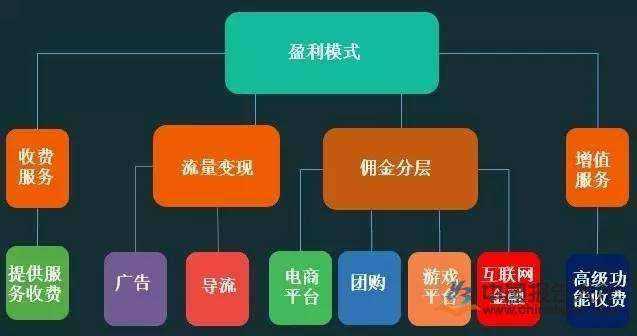

# 互联网时代的盈利模式

## 互联网为人们带来了许多便利，同时，也为人们带来无数的商机。我们知道，互联网这个神奇的网络，将我们的整个世界连成了一个整体，使地球变成了我们所说的地球村。而由于互联网的种种优点，使得人们都依赖于它，所以对商家来说，“流量”就是金钱。而在这个互联网时代，商家的盈利模式有以下几种。
# 一、卖广告
卖广告是早期中国互联网最原始的盈利模式，一直延续到了现在。在门户时代，四大门户网站就开始卖各种广告位，焦点图、通栏、弹窗等，经过20年的进化，广告形式越来越多样化，大数据让目标用户的定向也越来越精准，广告业务也从SSP走向了DSP。
# 二、电商卖货（包括实物产品和虚拟商品）
世界上最早的电子商务公司是如今的世界首富Jeff Bezos 在1995年创办的亚马逊。中国最早的电子商务公司则是马爸爸在1999年创办的8848。  
# 三、平台佣金抽成
平台促成交易后，向商家收取佣金，平台不直接生产创造价值，而是去整合资源。这种方式就像房地产中介里的链家，一头对接房东，另一头对接买房者，当交易达成时抽取2%的费用作为佣金。  
# 四、增值服务
基础功能免费，高级功能收费。先用免费的产品和服务去吸引用户，去抢占市场份额和用户规模，然后再通过增值服务或其他产品收费。  
# 五、收费服务
收费服务早已有之，例如家政服务、家教、导游、律师咨询等，但在互联网时代服务的类型变得更加多元化。  
# 六、金融运作
肉从冰箱里拿出来，再放回去。问：手里剩下啥？当然是油水啊！这就是腾讯和阿里为什么一直拼了命要抢夺用户的支付入口。在今年3月份沃尔玛站队腾讯，开始停用支付宝仅支持微信支付。  

